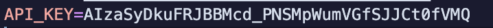

<br />
<p align="center">
  <a href="Readmeimages/site_logo.png">
    
  </a>

  <h3 align="center">Project Laravel</h3>

  <p align="center">
    A back-End Project that we managed to pull off a lot of resources to realise 
    <br />
    <a href="https://github.com/crushoverride007/bluekbmvirtualpass"><strong>Explore the docs »</strong></a>
    <br />
    <br />
    <a href="https://github.com/crushoverride007/bluekbmvirtualpass">View Demo</a>
    ·
    <a href="https://github.com/crushoverride007/bluekbmvirtualpass">Contact</a>
    ·
    <a href="https://github.com/crushoverride007/bluekbmvirtualpass">About Project</a>
  </p>
</p>


<details open="open">
  <summary>Table of Contents</summary>
  <ol>
    <li>
      <a href="#about-the-project">About The Project</a>
      <ul>
        <li><a href="#built-with">Built With</a></li>
      </ul>
    </li>
    <li>
      <a href="#getting-started">Getting Started</a>
      <ul>
        <li><a href="#prerequisites">Pre-requisites</a></li>
        <li><a href="#installation">Installation</a></li>
      </ul>
    </li>
    <li><a href="#optional">Optional</a></li>
    <li><a href="#contact">Contact</a></li>
    <li><a href="#acknowledgements">Acknowledgements</a></li>
  </ol>
</details>


## About The Project

[![Dashboard Screenshot][product-screenshot]](https://github.com/crushoverride007/bluekbmvirtualpass)

Your top management have decided to market a new solution called "Visitors Pass": This Web Application will allow the company executives to administer visits and visitors, 
user rights, other amenities like visitor's history, generated Badges. It will also keep a track of the whereabouts of each visitor and host throughout the day
and accordingly, record the details in a corporate file. This Visitor Management Software also manages to print an identity
badge for a visitor to enter the premises, thus, reducing the receptionist's workload because Visitlog will manage to track every visitor's record, virtually. 
It will also automatically create the list of the current number of visitors in the company for the emergency, if arises any. There are 3 categories of users in the app, 
an administrator, an employee, and a receptionist.

* As an employee:
When you want to visit an employee of the company, the latter must
create a new visit in the application by specifying the following
information: the nature of the visit, the date and time of arrival, time
of end of visit, Company or individual, if company, enter the name of
the company, the name, email, and phone number of the person
concerned, the persons accompanied (Text area), a photo (optional,
if not a default picture).
After having validated all the information of the visit, the user can
then print the badge in PDF format containing all the information
related to the visit.

* As an administrator:
in the home page of administrators, there is a dashboard which allows
you to display some statistics on visits: Number of visits, number of
visitors today, number of visitors the current month. The
administrator can manage user accounts (CRUD), List of visits.

* As a receptionist
The application shows all visits for the current day.

### Built With

We listed down below our used technologies during the project build-up.

* [VueJS](https://vuejs.org/)
* [Bootstrap](https://getbootstrap.com)
* [JQuery](https://jquery.com)
* [JavaScript](https://www.javascript.com/)
* [Laravel](https://laravel.com)
* [Php](https://www.php.net/)
* [Sass](https://sass-lang.com/)
* [MySQL](https://www.mysql.com/)


## Getting Started

To setup the project in your computer:

### Prerequisites

To start of the installation, you need first to run this command:
* npm
  ```sh
  npm install dev
  ```

### Installation

1/1. Get your google maps API Key at [https://console.cloud.google.com/apis/](https://console.cloud.google.com/apis/)


2. Clone the repo
   ```sh
   git clone `https://github.com/Crushoverride007/bluekbmvirtualpass.git`
   ```

3. Setup the .env file, like shown below

[![Environment Setup][environments-setup]](https://github.com/crushoverride007/bluekbmvirtualpass)

4. run composer update, to update and install if need be any dependencies that are required to run the project
   ```
   composer update
   ```
[![Composer update][composer-update]](https://github.com/crushoverride007/bluekbmvirtualpass)

5. Enter your API in `.env`
   ```
   API_KEY = 'ENTER YOUR API FROM GOOGLE CONSOLE'
   ```
[![Api part 1][api_google-maps-p1]](https://github.com/crushoverride007/bluekbmvirtualpass)
</br>

[![Api part 2][api_google-maps-p2]](https://github.com/crushoverride007/bluekbmvirtualpass)

</br>




6. Enter your Generated APP Key in `.env`
   ```
   php artisan key:generate
   ```

[![Key part1][key_generatep1]](https://github.com/crushoverride007/bluekbmvirtualpass)

</br>

[![Key part2][key_generatep2]](https://github.com/crushoverride007/bluekbmvirtualpass)

7. Create a database in phpmyadmin and make sure to name it the same as shown in `.env`
   ```
   DB_DATABASE = virtualpassbluekbm
   ```

[![Database part 1][creation_ofdbp1]](https://github.com/crushoverride007/bluekbmvirtualpass)

</br>

[![Database part 2][creation_ofdbp2]](https://github.com/crushoverride007/bluekbmvirtualpass)

8. Push the tables into your database
   ```
   php artisan migrate
   ```
9. Since we've a pre-existing data, you could also retrieve those data
   ```
   php artisan db:seed
   ```
10. Linking the path of files when uploading from `/storage` to `app/public`
   ```
   php artisan storage:link
   ```
11. To start the serve into your localhost `port:8000`
   ```
   php artisan serve
   ```


## Optional

* You can add the option to generate an appointment in your
calendar as well as that of the person concerned.
* The presence of a QR Code into visitor’s badge containing the
URL of invitation.
* Sending a email to employee and visitor containing the visit’s
details and the QR code.

_This optional quest isn't necessary but we managed to pull it through [Documentation](https://github.com/crushoverride007/bluekbmvirtualpass)_

2. install the library qrcode
   ```sh
   composer require werneckbh/laravel-qr-code
   ```

* To add to the spice we've added a google maps card, to feature in most important phases of our project


## Contact

* Mouhcine MESMOUKI - [@m_mesmouki](https://twitter.com/m_mesmouki) - mouhcine.mesmouki7@gmail.com
* Ayman BENNANI - [@ayman_bennani](https://www.instagram.com/aymanbennani/) - ayman.bennani@ynov.com
* Mouad KECHAMNE - [@mouadkechmane](https://www.instagram.com/mouadkechmane/) - mouad.kechmane@ynov.com

Project Link: [github.com/Crushoverride007/bluekbmvirtualpass](https://github.com/Crushoverride007/bluekbmvirtualpass)


## Acknowledgements
* [Our Back-End Teacher](http://amineelkhal.com/)
* [Our Github Organization](https://github.com/Devame-corporation)


[product-screenshot]: Readmeimages/Dashboard.PNG
[qr-code]: Readmeimages/qrcode_generating.PNG
[environments-setup]: Readmeimages/environments_setup.PNG
[composer-update]: Readmeimages/composer_update.PNG
[api_google-maps-p1]: Readmeimages/apiformaps.PNG
[api_google-maps-p2]: Readmeimages/api_google_maps_generate.PNG
[api_google-maps-p3]: Readmeimages/api_key-in-env.PNG
[key_generatep1]: Readmeimages/key_generate-part1.PNG
[key_generatep2]: Readmeimages/key_generate-part2.PNG
[creation_ofdbp1]: Readmeimages/creation_ofdbp1.PNG
[creation_ofdbp2]: Readmeimages/creation_ofdbp2.PNG
